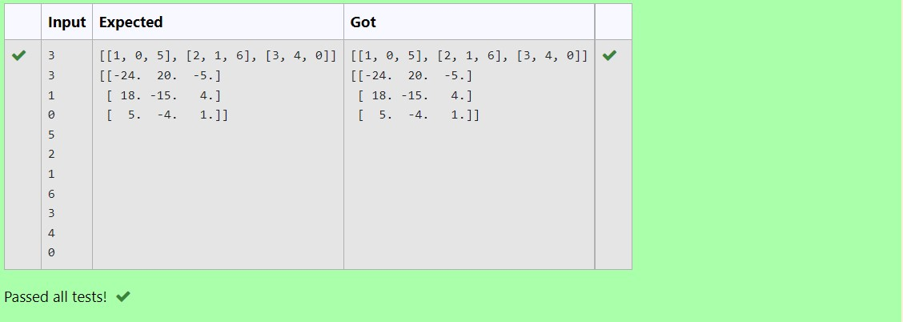

# Inverse-of-matrix

## AIM:
 To python program to inverse the matrix.

## ALGORITHM:
### Step 1:
import numpy as np.
### Step 2:
Ask user to input values for two matrices.
### Step 3:
Use for loop.
### Step 4:
Input the inverse formula.
### Step 5:
Run the program.

## PROGRAM:
~~~
## NAME: R.SOMEASVAR
## REF:NO: 21500795
import numpy as np
l1,l2=[],[]
r,c=int(input()),int(input())
for i in range(c):
    for j in range(c):
        num=int(input())
        l1.append(num)
    l2.append(l1)
    l1=[]
print(l2)
x=np.array(l2)
y=np.linalg.inv(x)
print(y)
~~~

## OUTPUT:

## RESULT:
Python program to inverse the matrix has been created successfully.

